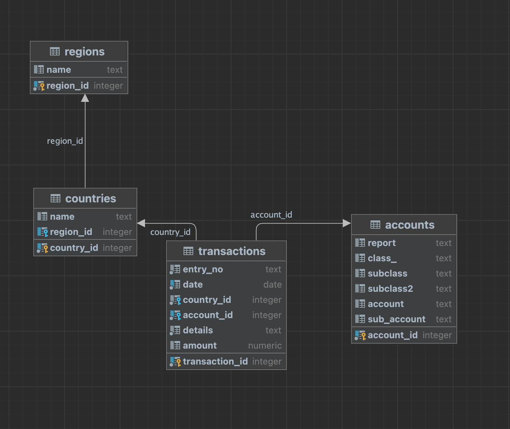

# Overview

 a prototype web service to compute account balances given a transaction ledger.

An account balance represents the amount of money in a specific account at a given point in time. It takes into account both deposits (credits) and withdrawals (debits) made to the account. If the credits exceed the debits, the account has a positive balance, indicating surplus funds. Conversely, if the debits exceed the credits, the account has a negative balance, suggesting a deficit.

Users should be able to send a request with an `Account ID` and a `Date` as input, and receive the balance as of that date as output. Optionally, the user should be able to pass in a `Region ID` to filter the results to only transactions in that country's accounts.

Additionally, users should be able to ask for balances as of named dates such as "Q1" or "Q3", corresponding to the end dates for those periods. Beyond that, the design of the API or any additional routes you think might be useful is up to you.


## Introduction
This project is a Fast API application and uses Docker Compose to set up the application and its dependencies. The application is built using Python 3.8 and uses the following libraries:
- Python
  - Fast API that is built on top of Starlette and Pydantic for building the API. 
  - Tortoise ORM for interacting with the database
  - Pytest for testing
- Infrastructure:
  - Uvicorn for running the application server
  - Docker Compose for setting up the application and its dependencies
  - Docker for containerization
  - PostgreSQL for the database (web_dev and web_test)

## Prerequisites
Before you begin, ensure you have the following installed:
1. Git
1. Docker
1. Docker Compose
You can check if Docker and Docker Compose are installed correctly by running:
```bash
docker --version
docker-compose --version
```
## Installation
1. Clone the repo
```bash
git clone tamhtran/inscope-takehome
cd inscope-takehome
```
2. Build the Docker image
Navigate to the directory containing your docker-compose.yml file and run:
```bash
docker-compose up build
```
This command will set up all necessary containers for the application.

## Accessing the application
The Fast API application is running on port 8000. You can access the application at http://localhost:8000/docs. This will bring up the Swagger UI where you can interact with the API.
The PostgreSQL database is running on port 5432. You can access the database using the following credentials: postgres/postgres at localhost:5432.


## Assumptions
* The data is static and will not change while the service is running.
* The provided data files are loaded into postgres web_dev database at the time the server started via scripts files stored in the project/db. Some transformations are applied to the data before loading into the database. The transformations are documented in the db scripts. The data are loaded into the following tables:

* This is not a production-ready application. The application is built as a prototype to demonstrate the functionality of the API.
* The application is not optimized for performance and scalability. For example, the application loads all data into memory at the time the server starts. This is not ideal for large datasets. 
* The application also does not have any authentication or authorization. The application is not tested for security vulnerabilities. The application is not tested for performance and scalability.

